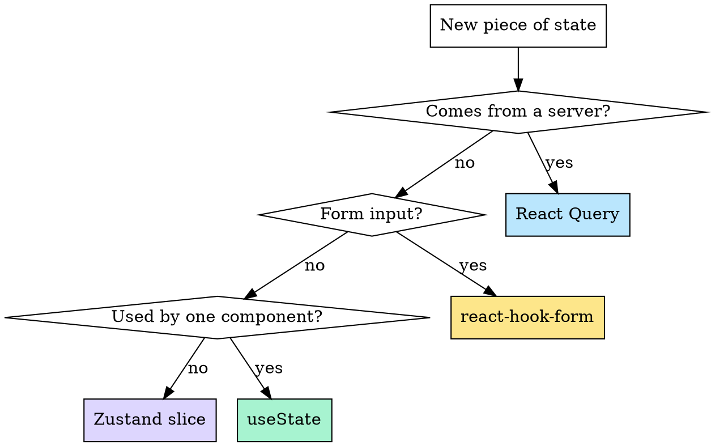

# State Management
{: .no_toc }

The biggest mistake I see is treating "state" as one thing. It isn't. Server data and client UI state have totally different lifecycles, and they want totally different tools.

---

## The two-bucket rule

| Bucket | What lives here | Tool |
|:-------|:----------------|:-----|
| **Server state** | Anything that comes from an API and could go stale | **TanStack Query** |
| **Client state** | UI flags, form drafts, theme, auth tokens (in memory) | **Zustand** |

If I'm ever tempted to put a `users` array into Zustand because "I need to access it everywhere," that's the bug. React Query already gives me a global cache, with refetching, deduping, and staleness — for free.

---

## Zustand: small slices, not a god-store

I create **one store per feature** that needs cross-component state, plus a small set of app-wide stores (theme, auth-session). Each store is tiny:

```ts
import { create } from "zustand";

interface AuthState {
  access_token: string | null;
  refresh_token: string | null;
  setTokens: (a: string, r: string) => void;
  clear: () => void;
}

export const useAuthStore = create<AuthState>((set) => ({
  access_token: null,
  refresh_token: null,
  setTokens: (access_token, refresh_token) =>
    set({ access_token, refresh_token }),
  clear: () => set({ access_token: null, refresh_token: null }),
}));
```

### Patterns I follow

- **Selectors over destructuring.** `const token = useAuthStore((s) => s.access_token)` re-renders only when `access_token` changes. Destructuring the whole store re-renders on every change.
- **Actions live in the store.** Components call `setTokens(...)`, not `setState({ access_token: ... })`. The store owns its mutations.
- **No async logic inside the store.** Async belongs in services/hooks; the store is a sync state container.
- **Persist only what must survive a reload.** Use the `persist` middleware sparingly — auth tokens, theme. Not server data.

---

## React Query: configure once, use everywhere

I set sensible defaults at the `QueryClient` level and override only when a specific query needs different behavior.

```ts
export const queryClient = new QueryClient({
  defaultOptions: {
    queries: {
      staleTime: 30 * 1000,            // 30s — assume data is fresh
      gcTime: 5 * 60 * 1000,           // 5m — keep in cache after unmount
      refetchOnWindowFocus: false,     // I refetch deliberately, not on focus
      retry: (failureCount, error) => {
        if (isAuthError(error)) return false;  // don't retry 401s
        return failureCount < 2;
      },
    },
    mutations: { retry: 0 },
  },
});
```

### Query keys are structured, not strings

```ts
// Bad — easy to mistype, hard to invalidate selectively
useQuery({ queryKey: ["orders-pending-user-42"], ... });

// Good — invalidating ["orders"] hits everything related
useQuery({ queryKey: ["orders", { status: "pending", userId: 42 }], ... });
```

---

## What does **not** belong in either tool

- **Form state** → `react-hook-form`. Forms have their own lifecycle (touched, dirty, validation) that's miserable to rebuild in Zustand.
- **Derived values** → just compute them. `const total = items.reduce(...)`. Don't `useState` something you can derive.
- **One-shot UI flags (open / close a modal)** → component-local `useState`. Don't pollute Zustand with `isModalOpen` unless multiple unrelated components need it.

---

## The decision tree



If I can't fit a new piece of state into one of these four buckets, I'm probably about to invent something I'll regret.
